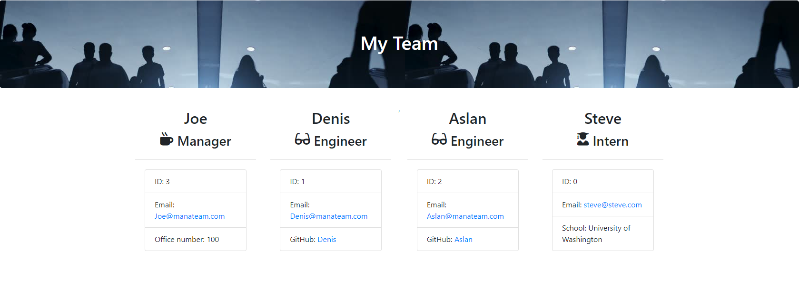

# Unit 10 OOP Homework: Template Engine - Employee Summary [](http://unlicense.org/) 

## Description
    This generates a team page (HTML) from a CLI application.


  
  ## Table of Contents
  1. [User Story](#UserStory)
  2. [Installation](#Installation)
  3. [Usage](#Usage)
  4. [Tests](#Tests)
  5. [GitHub Links](#GitHubLinks)


  ## UserStory
  ```
  As a manager
  I want to generate a webpage that displays my team's basic info
  so that I have quick access to emails and GitHub profiles
  ```

  ## Installation
  [Intallation Video](https://drive.google.com/file/d/1dwzlDfxg3-XC1g0V89JrcU_TxbGkail3/view?usp=sharing)
  
    Download the repo off of GitHub. node install. etc.

  
  ## Usage
  [How to use Video](https://drive.google.com/file/d/1HZlUHFgxIwMKxz2Zh2nRL-OUsQhQO6DG/view?usp=sharing)

    You run it from the command line and follow the prompts. Use node index.js.
  
  ## Tests
  
    npm tests. The application passes all the provided tests.
   
  ## GitHubLinks
  
  [Git Hub Username](https://www.github.com/CodySamuels)
  
  [The Repo](https://github.com/CodySamuels/template-engine)